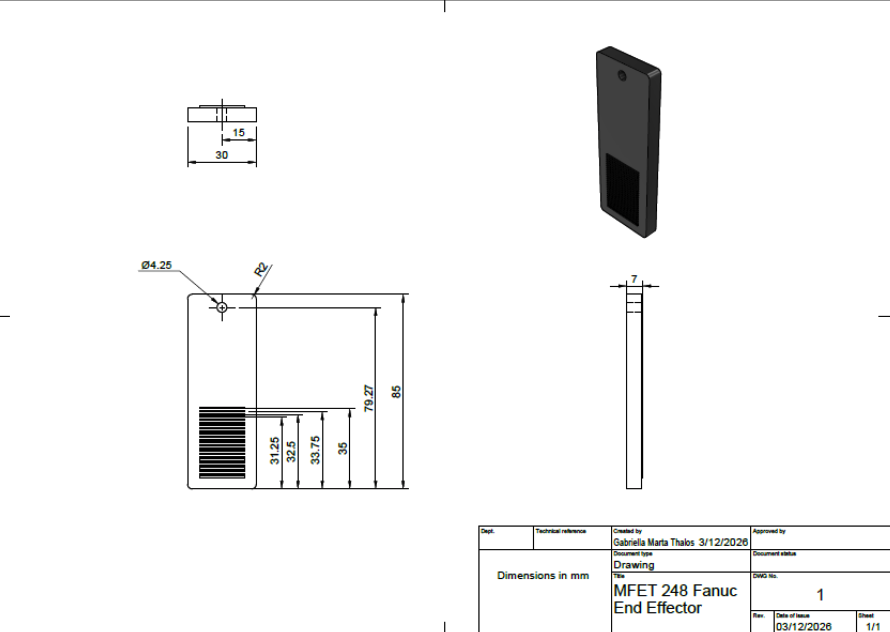
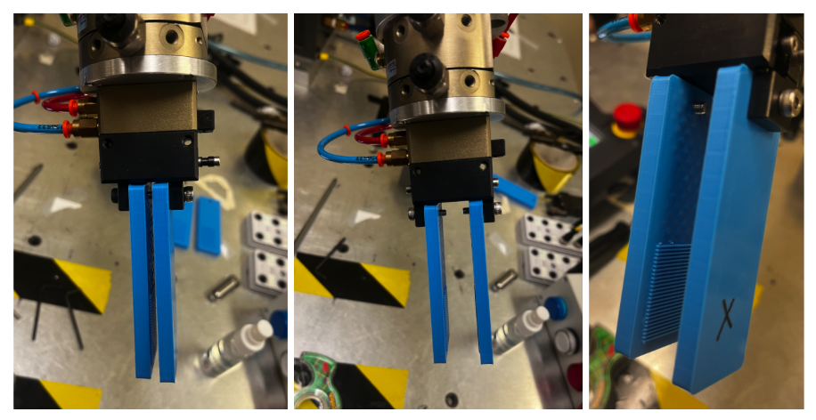
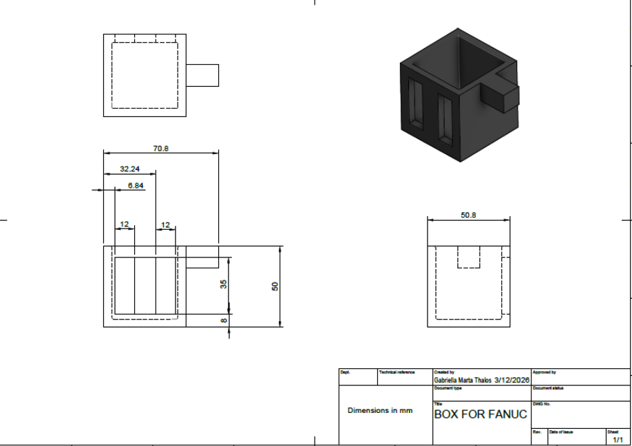
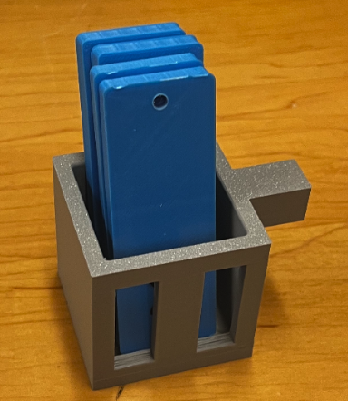
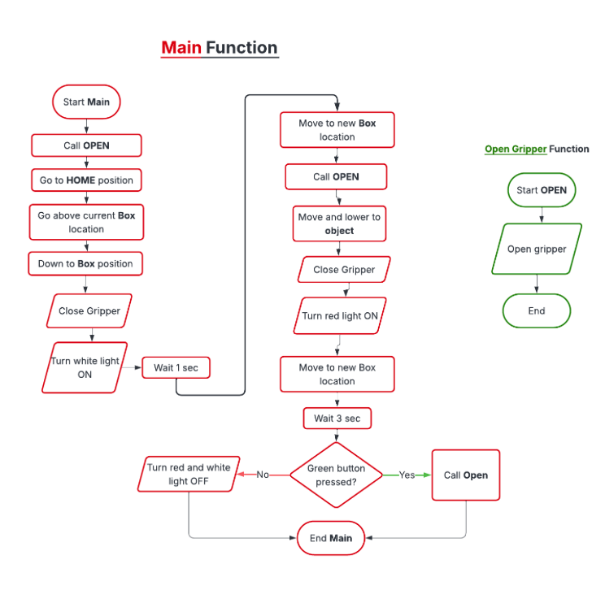
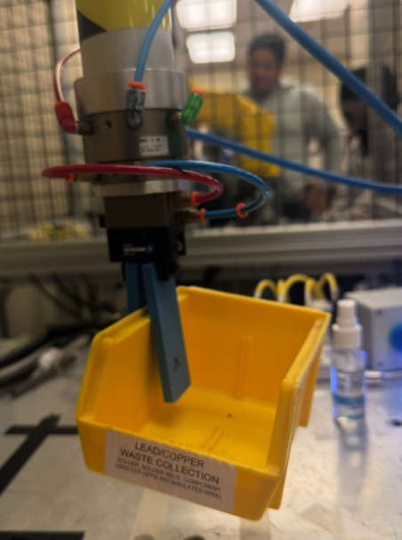
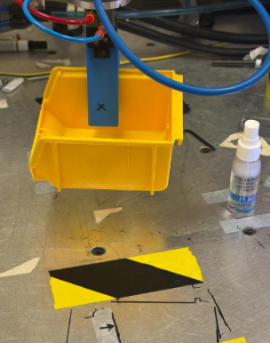
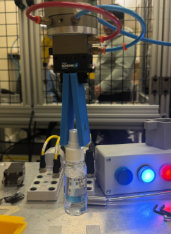
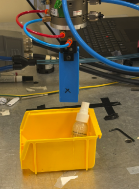

# MFET 248 FANUC Final Project

<h1 align="center">Declutter Robot</h1>

<p align="center">
  A FANUC pick-and-place project for organizing a workspace with custom end-of-arm tooling, I/O lights, and a manual release button.
</p>

<p align="center">
  
</p>

<p align="center">
  
  
</p>

<p align="center">
  <strong>Members:</strong> Adyaa Khera, Gabriella Thalos<br>
  <strong>Lab Section:</strong> Thursday 11:30-1:20 PM, Spring 2026
</p>

<p align="center">
  
</p>

## Quick Project Facts

| Item | Details |
| --- | --- |
| Project | Declutter Robot |
| Robot Series | FANUC LR Mate|
| Mode of Programming | Teach Pendant|
| Core Task | Pick, place, and declutter a workspace |
| Main Inputs/Outputs | 2 lights, 1 push button |
| Customized designs | End effector, storage box |

## Overview

This project demonstrates a simple real-world automation task: a FANUC robot picks up a storage box, places it in a registered position, then picks up objects and drops them into the box with user-controlled release. The system combines robot motion, basic digital I/O, a custom gripper, and a storage bin to simulate workspace decluttering and organized part handling.

The goal was not only to complete a working sequence, but also to show how mechanical design and robot programming must work together for the task to succeed.

## Contents

- [Overview](#overview)
- [What the Robot Does](#what-the-robot-does)
- [System Highlights](#system-highlights)
- [Hardware](#hardware)
- [Software](#software)
- [Program Logic](#program-logic)
- [Program Explanation](#program-explanation)
- [Results and Lessons](#results-and-lessons)
- [Future Improvements](#future-improvements)
- [Project Gallery](#project-gallery)

## What the Robot Does

- Starts at the HOME position.
- Moves to a taught position and picks up the storage container.
- Turns on a light to show that the task has started.
- Places the storage container in a central position on the table.
- Picks up the object to be organized.
- Turns on a second light to show the robot is handling the object.
- Moves the object above the bin and waits for a button press.
- Opens the gripper only after the user presses the button.
- Turns off the lights when the task is complete.

## System Highlights

- Custom 3D-printed end effector for better grip and friction.
- Storage box designed for reliable pickup and placement.
- Two indicator lights for task status feedback.
- One push button for manual release confirmation.
- Simple FANUC program using motion instructions, I/O, program calls, and a conditional statement.

## Design Decisions

The project focused on a few practical design choices that made the sequence more reliable:

- The end effector geometry was modified to improve friction and reduce slipping.
- The storage box included grasp-friendly features so the robot could pick it up consistently.
- The release step used a push button so the operator could confirm the object was positioned correctly above the bin to prevent spills.
- Indicator lights provided a simple visual status cue during the motion sequence.

## Hardware

### End-of-Arm Tooling

We used the standard FANUC gripper and modified the contact surface by adding edges to increase friction. This improved the robot’s ability to hold the box and the object more securely during motion. The final design was created through testing and iteration to improve grip strength and reduce slipping.

**Figure 1.** Orthographic projection drawings of the final end effector.
<p align="center">
  
</p>

**Figure 2.** 3D-printed end effector in close, open, and isometric views.

<p align="center">
  
</p>

### Storage Box

We also designed a compact storage bin that the robot could grip and place on the table. The design included slots that made it easier for the gripper to grasp the container reliably.

**Figure 3.** Orthographic projection drawings of the storage box.

<p align="center">
  
</p>

**Figure 4.** Printed box with different variations of end effectors.

<p align="center">
  
</p>

### I/O Hardware

The project used:

- 2 indicator lights
- 1 push button input

One light indicates the robot is handling the storage container, and the other indicates it is handling the object. The button allows the operator to confirm when the object is correctly positioned above the bin before release.

**Figure 5.** DO/DI panel while the robot is operating.

<p align="center">
  
</p>

## Software

The FANUC program was written to keep the sequence simple, reliable, and easy to follow. It uses:

- taught positions
- linear motions
- a micro program for opening the gripper
- robot output control for closing the gripper
- digital outputs for lights
- a digital input check for the button press
- a timed wait before release

### Program Logic

1. Call the OPEN routine so the gripper starts in a known state.
2. Move to the home and bin pickup positions.
3. Close the gripper and turn on the first light.
4. Move the bin to the center of the table.
5. Pick up the object and turn on the second light.
6. Move above the bin and wait 3 seconds.
7. Release the object only if the button is pressed.
8. Turn off both lights after completion.

### Robot Program

**[Download AGMFINAL.fanuc](program/AGMFINAL.fanuc)** 
*without OPEN subroutine

```fanuc
AGMFINAL

1: CALL OPEN
2: L PR[50] 100mm/sec FINE
3: L PR[51] 100mm/sec FINE
4: L P[1] 100mm/sec FINE
5: RO[4] = ON
6: DO[101] = ON
7: WAIT 1.00 (sec)
8: L P[2] 100mm/sec FINE
9: L P[3] 100mm/sec FINE
10: L P[6] 100mm/sec FINE
11: CALL OPEN
12: L P[9] 100mm/sec FINE
13: L P[4] 100mm/sec FINE
14: L P[5] 100mm/sec FINE
15: RO[4] = ON
16: DO[102] = ON
17: L P[7] 100mm/sec FINE
18: L P[8] 100mm/sec FINE
19: WAIT 3.00 (sec)
20: IF DI[102] = ON, CALL OPEN
21: DI[102] = OFF
22: DI[101] = OFF
```

### Program Explanation

**Figure 6.** Code execution flowchart for the robot program.

<p align="center">
  
</p>

The `OPEN` program ensures the gripper starts open, regardless of where the robot was stopped in the previous cycle. The robot then moves through the taught positions to pick up the bin, place it, and later pick up the object that will be stored.

When the robot is holding the object above the bin, it waits for the operator’s button press. This manual confirmation reduces the chance of releasing the object before it is properly aligned over the container, which is especially helpful for delicate items.

## Results and Lessons

This project gave us practical experience with robot operation, motion planning, digital I/O, and conditional programming on a FANUC system. It also showed how important mechanical design is to the success of a robotic task. Even a good program can fail if the gripper does not hold the object securely or if the tool geometry is not well matched to the workpiece.

We also learned that small changes in tolerances, position accuracy, and path planning can have a large effect on performance. Testing, debugging, and redesigning were all essential parts of getting the system to work.

The final sequence combined motion, I/O feedback, and user confirmation into a compact automation demo that was easy to explain and demonstrate.

## Future Improvements

- Improve the end effector geometry for a stronger and more consistent grip.
- Shorten the tool to increase stiffness and reduce bending.
- Tighten tolerances on screw holes and printed joints.
- Optimize robot paths to reduce unnecessary motion.
- Add more automation with sensors instead of relying mainly on manual input.
- Expand the program to support a more advanced decluttering or sorting routine.

## Project Gallery


### CAD Drawings

<p align="center">
  
</p>

<p align="center">
  
</p>

### Printed Parts

<p align="center">
  
</p>

<p align="center">
  
</p>

### Robot in Motion

<table>
  <tr>
    <td align="center" width="50%">
      
      <p><strong>1. Pick Container</strong></p>
    </td>
    <td align="center" width="50%">
      
      <p><strong>2. Place Container</strong></p>
    </td>
  </tr>
  <tr>
    <td align="center" width="50%">
      
      <p><strong>4. Pick up object</strong></p>
    </td>
    <td align="center" colspan="2">
      
      <p><strong>5. Place object in bin!</strong></p>
    </td>
  </tr>
</table>

### Control Flow

<p align="center">
  
</p>

---

<p align="center">
  Built for MFET 248 Fanuc Final Project
</p>
